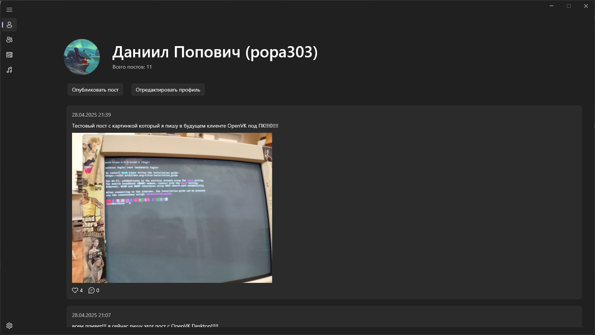
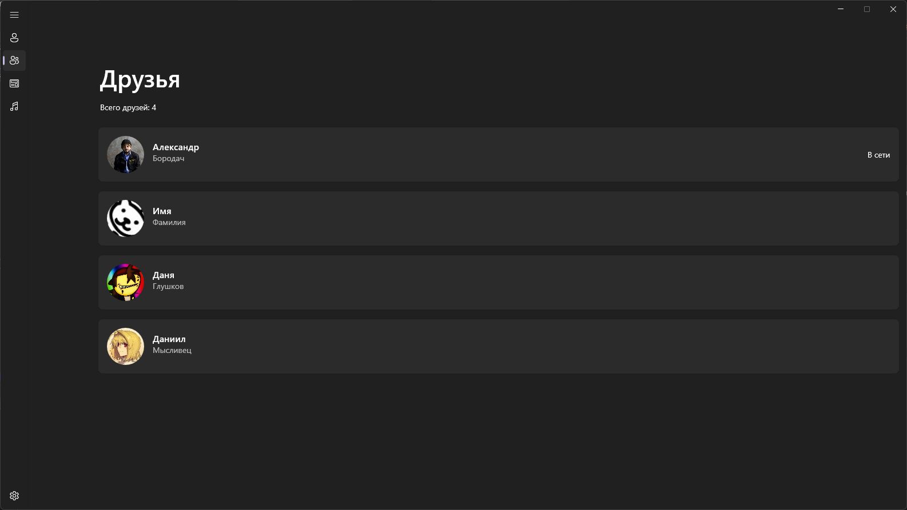
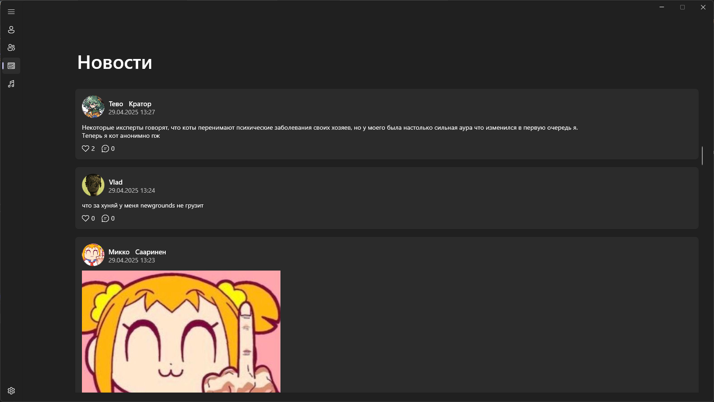

# OpenVK Desktop - клиент OpenVK под Windows в Modern стиле

## Состояние проекта

На текущий момент, ведется активная разработка проекта и находится она в ветке Pre-release, поскольку еще многий функционал не реализован/не доделан до конца.

## Вопросы

Имеются вопросы касательно проекта? Напишите на почту contact@fayzetwin.xyz.

## Билд проекта

На данный момент, у клиента еще нет готового билда, но вы его можете собрать сами! Пока что, клиент можно собрать только под Windows. 

Требования для билда проекта: 

- .NET версии 9.0, 8.0
- [Windows SDK](https://go.microsoft.com/fwlink/?linkid=2313119)
- [Windows App SDK](https://aka.ms/windowsappsdk/1.7/latest/windowsappruntimeinstall-x64.exe)
- Visual Studio 2022 (через dotnet cli забилдить адекватно не получится)

## Скриншоты

