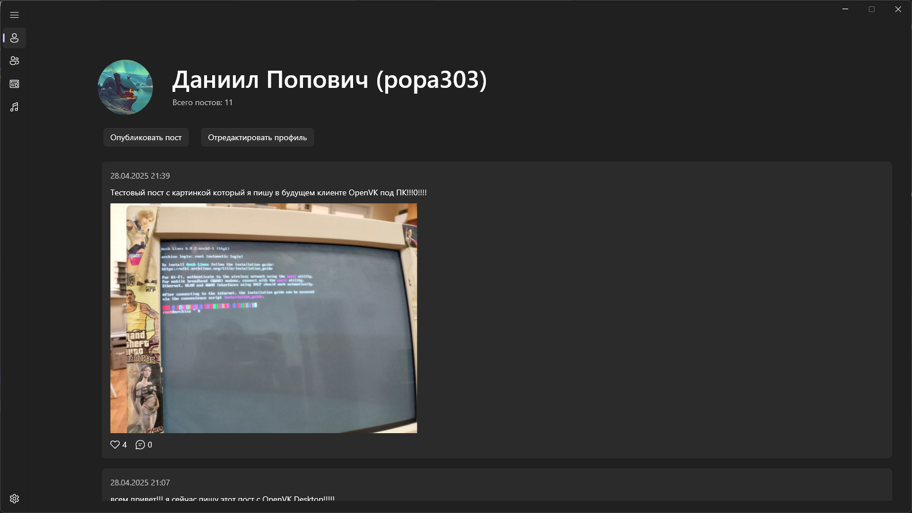
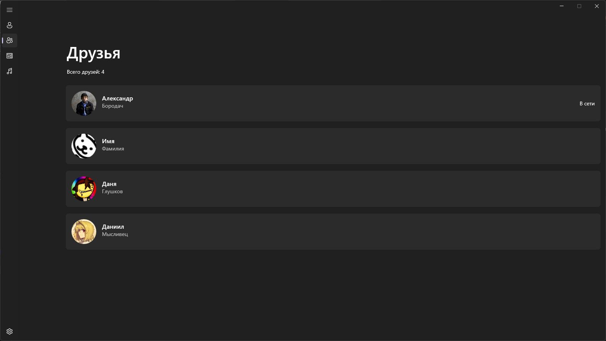
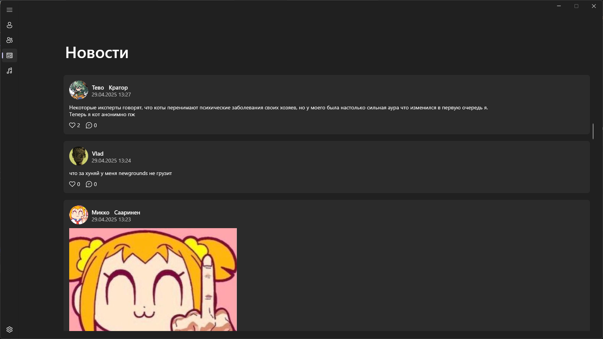

<<<<<<< HEAD
# OpenVK Desktop - клиент OpenVK под Windows в Modern стиле

=======
# OpenVK Desktop - клиент для соц. сети OpenVK в UWP стиле под Windows.

>>>>>>> 644b4d6b747c1e50274178d5788b57dd38cc8edf

## Состояние проекта

<<<<<<< HEAD
На текущий момент, ведется активная разработка проекта и находится она в ветке Pre-release, поскольку еще многий функционал не реализован/не доделан до конца.
=======
На текущий момент, проект хоть и вышел в релиз, но все еще ведется активная разработка проекта, поскольку некоторый функционал еще не сделан/недоделан до конца. 
>>>>>>> 644b4d6b747c1e50274178d5788b57dd38cc8edf

## Вопросы

Имеются вопросы касательно проекта? Напишите на почту contact@fayzetwin.xyz.

## Билд проекта

<<<<<<< HEAD
На данный момент, у клиента еще нет готового билда, но вы его можете собрать сами! Пока что, клиент можно собрать только под Windows. 
=======
У проекта уже имеется готовый билд! Скачать вы его можете либо в разделе Releases в репозитории, [либо на репозитории разработчика (cloud.fayzetwin)](https://cloud.fayzetwin.xyz/s/Q6SaejDPK4kbDxD)
Но, если вы параноик - вы можете забилдить проект сами, поскольку исходники все - открыты (что очевидно).
>>>>>>> 644b4d6b747c1e50274178d5788b57dd38cc8edf

Требования для билда проекта: 

- .NET версии 9.0, 8.0
- [Windows SDK](https://go.microsoft.com/fwlink/?linkid=2313119)
- [Windows App SDK](https://aka.ms/windowsappsdk/1.7/latest/windowsappruntimeinstall-x64.exe)
- Visual Studio 2022 (через dotnet cli забилдить адекватно не получится)

<<<<<<< HEAD

## Скриншоты

=======
Мудрить с билдом проекта особо не нужно:
необходимо лишь открыт .sln файл проекта в VS2022 и уже нажать нужную кнопку для билда клиента:

## Баги 

Если вы обнаружили баги, уязвимости или что-то подобное в клиенте, просьба об этом сообщить мне в issues репозитория клиента. Нет смысла мне писать на почту, или куда-либо еще. :3

## Соц. сети проекта 

[Наш Telegram канал](https://t.me/ovkdesktop) (там же вы можете узнать как поддержать проект материально, btw) 

[Telegram топик о нашем клиенте в OpenVKMobile](https://t.me/openvkmobile/18335)

## Скриншоты

>>>>>>> 644b4d6b747c1e50274178d5788b57dd38cc8edf
